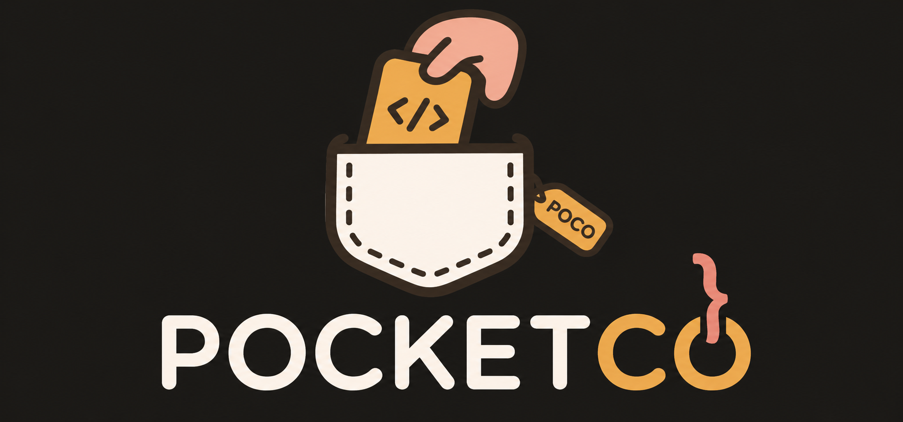

<div align="center">

<!-- logo -->


### POCKETCO 📱

**알고리즘 학습의 모든 단계를 하나의 앱에서 — 개념부터 AI 피드백까지**

[]()
[]()
[]()
[]()
<br/> []()

</div>

<br />

## 📝 소개

**POCKETCO**는 알고리즘을 처음 배우는 학생부터 코딩 테스트를 준비하는 취준생까지, 학습의 전 단계를 하나의 앱 안에서 끊김 없이 경험할 수 있는 **모바일 알고리즘 학습 플랫폼**입니다.

기존 알고리즘 학습 서비스들은 대부분 웹 기반의 문제 풀이에만 집중되어 있습니다. POCKETCO는 **개념 학습 → 응용 학습 → 실전 문제 풀이 → AI 코드 리뷰**의 4단계 학습 플로우를 제공하며, 모바일에서도 코드를 작성하고 실행할 수 있는 통합 코드 에디터를 탑재했습니다.

### 타겟 사용자
- 🎓 알고리즘 개념이 부족한 CS 입문자
- 💼 코딩 테스트를 준비 중인 취업 준비생
- 🔥 꾸준한 학습 루틴이 필요한 개발자 지망생

<br />

## 💁‍♂️ 프로젝트 팀원

<!-- 
  ⚠️ GitHub 사용자명을 실제 팀원 것으로 교체해주세요!
  img src의 ?size=120 부분은 프로필 이미지 크기입니다.
-->

|팀원 1|팀원 2|팀원 3|팀원 4|팀원 5|
|:---:|:---:|:---:|:---:|:---:|
|  |  |  |  |  |
|[이름](https://github.com/깃허브_사용자명)|[이름](https://github.com/깃허브_사용자명)|[이름](https://github.com/깃허브_사용자명)|[이름](https://github.com/깃허브_사용자명)|[이름](https://github.com/깃허브_사용자명)|

<br />

## 🎯 핵심 기능

### 4단계 학습 플로우

| 단계 | 기능 | 설명 |
|:---:|------|------|
| 1 | **개념 학습** | 슬라이드 형식으로 알고리즘 개념을 학습합니다 |
| 2 | **응용 학습** | 빈칸 채우기 문제로 이해도를 확인합니다 |
| 3 | **실전 문제** | 내장 코드 에디터로 직접 코드를 작성하고 제출합니다 |
| 4 | **AI 코드 리뷰** | 제출한 코드에 대한 AI 피드백을 받습니다 |

### 부가 기능

| 기능 | 설명 |
|------|------|
| 🧠 **CS 퀴즈** | OX 형식의 CS 지식 퀴즈 |
| 📊 **학습 통계** | GitHub 스타일 잔디 그래프, 연속 학습 스트릭 |
| ⭐ **즐겨찾기** | 문제 북마크 및 모아보기 |
| 📋 **제출 기록** | 전체 제출 이력 및 정답/오답 확인 |


<br />

## 🎬 시연 영상


<div align="center">

[](https://www.youtube.com/watch?v=FnfCaYPbP0E)

</div>

<br />

## 📱 화면 구성

<!-- 
  ⚠️ 화면 캡처/GIF를 넣어주세요!
  권장: 각 화면별 GIF 또는 스크린샷
  예시: 에뮬레이터 또는 실기기에서 화면 녹화 후 GIF로 변환
-->

|로그인 화면|홈 화면|
|:---:|:---:|
|||
|Google / GitHub / Email 소셜 로그인 지원|잔디 그래프, 스트릭, 빠른 메뉴|

|개념 학습|응용 학습|
|:---:|:---:|
|||
|슬라이드 형식의 개념 학습 + 마크다운 렌더링|빈칸 채우기로 코드 이해도 확인|

|코드 에디터|실행 결과|
|:---:|:---:|
|||
|Sora Editor 기반 코드 에디터 + 스마트 키보드|테스트 케이스별 실행 결과 확인|

|AI 코드 리뷰|CS 퀴즈|
|:---:|:---:|
|||
|코드 분석 + 개선 사항 + 개선 코드 제안|OX 형식의 CS 지식 퀴즈|

<br />

## 🏗️ 프로젝트 구조

```
app/src/main/java/com/example/fe/
├── api/                  # Retrofit API Service 인터페이스
├── common/               # 공통 유틸 (TokenManager 등)
├── data/                 # DTO, 데이터 모델
├── feature/              # 기능별 패키지
│   ├── auth/             # 로그인 / 회원가입
│   ├── home/             # 홈 화면 (잔디, 스트릭)
│   ├── concept/          # 개념 학습
│   ├── practice/         # 응용 학습 (빈칸 채우기)
│   ├── solver/           # 코드 에디터 & 문제 풀이
│   ├── aireview/         # AI 코드 리뷰
│   ├── csquiz/           # CS OX 퀴즈
│   ├── list/             # 문제/주제 목록
│   ├── step/             # 학습 단계 선택
│   └── profile/          # 프로필 & 마이페이지
├── navigation/           # NavGraph (화면 전환)
└── ui/                   # 디자인 시스템 (테마, 색상, 폰트)
```

<br />

## ⚙ 기술 스택

### Android / Mobile
<div>


</div>

### Architecture & Libraries
<div>


</div>

### Auth & Services
<div>


</div>

### Tools
<div>


</div>

<br />

## 📐 아키텍처

<div align="center">
  
</div>


## 🔧 주요 구현 포인트

### 🔐 통합 로그인 시스템
Firebase Auth 기반으로 **Google, GitHub, Email** 세 가지 소셜 로그인을 지원합니다. 소셜 최초 접근 시 닉네임/주력 언어 등 추가 정보를 입력받는 `completeSocialSignUp` 단계를 거쳐 자연스럽게 프로필 체계와 연결됩니다.

### 📝 모바일 코드 에디터
Sora Editor를 Compose의 AndroidView 브릿지로 통합하여 모바일에서도 실제 IDE와 유사한 코딩 경험을 제공합니다.
- 언어별 문법 하이라이팅 (Java / C++ / Python / JavaScript)
- 자동 괄호 닫기 + 커서 중간 위치
- 스마트 중괄호 자동완성 ({ + Enter → 들여쓰기)
- 3페이지 특수문자 보조 키보드

### 🤖 AI 코드 리뷰
코드 제출 후 서버의 비동기 AI 분석 결과를 **2초 간격 폴링**으로 수신합니다. 코드 리뷰, 개선 사항, 개선된 코드를 마크다운으로 렌더링하여 표시합니다.

### 🌱 학습 통계 & 잔디 그래프
GitHub 스타일의 24주(168일) 잔디 그래프를 Compose LazyRow로 직접 구현했습니다. 제출 횟수에 따라 셀 색상을 4단계로 구분하고, 연속 학습 스트릭을 자동 계산합니다.

### 🧩 응용학습 빈칸 채우기
서버에서 받은 코드 템플릿의 빈칸(`__`)을 정규식으로 파싱하여, **문법 하이라이팅과 빈칸 슬롯을 동시에 렌더링**하는 인터랙티브 UI를 구현했습니다.

<br />

## 🤔 기술적 이슈와 해결 과정

- **Compose ↔ Android View 브릿지 이슈**
  - Sora Editor(View 기반)를 Compose에서 사용할 때 발생하는 스크롤/포커스 충돌을 해결
  - 에디터 포커스 시 HorizontalPager 스와이프를 동적으로 잠금/해제

- **에디터 커서 1번 줄 점프 버그**
  - ViewModel → Editor 코드 동기화 시 `setText()` 재호출로 커서 초기화되는 문제
  - `AtomicReference`로 마지막 전송 코드를 추적하여 불필요한 `setText()` 호출 방지

- **키보드와 UI 레이아웃 충돌**
  - `SOFT_INPUT_ADJUST_RESIZE` + `imePadding()`으로 키보드 높이만큼 자동 조정
  - 에디터 탭 전환 시 윈도우 설정 자동 원복

- **오버스크롤 글로우 효과 제거**
  - Sora Editor 내부 EdgeEffect 필드를 리플렉션으로 접근하여 투명 처리

<!-- 
  💡 블로그나 별도 문서에 기술적 이슈 해결 과정을 정리하면 더 좋습니다!
  예시:
  - [Sora Editor를 Compose에 통합하면서 겪은 문제들](블로그 링크)
  - [모바일 코드 에디터 키보드 처리 가이드](블로그 링크)
-->

<br />

## 🚀 시작하기

### 사전 요구사항
- Android Studio Hedgehog 이상
- JDK 17
- Android SDK 34 (minSdk 24)

### 설치 및 실행

```bash
# 1. 레포지토리 클론
git clone https://github.com/KozzilzzilE/FE.git

# 2. secrets.properties 설정
cp secrets.properties.example secrets.properties
# secrets.properties 파일을 열어 BASE_URL 등 필요한 값을 입력합니다

# 3. google-services.json 배치
# Firebase Console에서 다운로드한 google-services.json을 app/ 디렉토리에 복사합니다

# 4. Android Studio에서 프로젝트 열기 → Sync → Run
```

### 환경 변수 설정

`secrets.properties` 파일에 다음 값을 설정합니다:

```properties
BASE_URL=http://your-server-url:8080/
```

<br />

## 📊 차별점

| | POCKETCO | 기존 서비스 (백준, 프로그래머스 등) |
|:--:|----------|--------------------------------------|
| 학습 단계 | 개념 → 응용 → 실전 → AI 리뷰 | 문제 풀이 위주 |
| AI 피드백 | 제출 코드 자동 분석 & 개선 제안 | 없음 |
| 학습 동기부여 | 잔디 그래프, 스트릭, 통계 | 제한적 |
| 플랫폼 | **모바일 네이티브 (Android)** | 웹 중심 |
| 코드 에디터 | 문법 하이라이팅 + 스마트 키보드 | 웹 에디터 |


